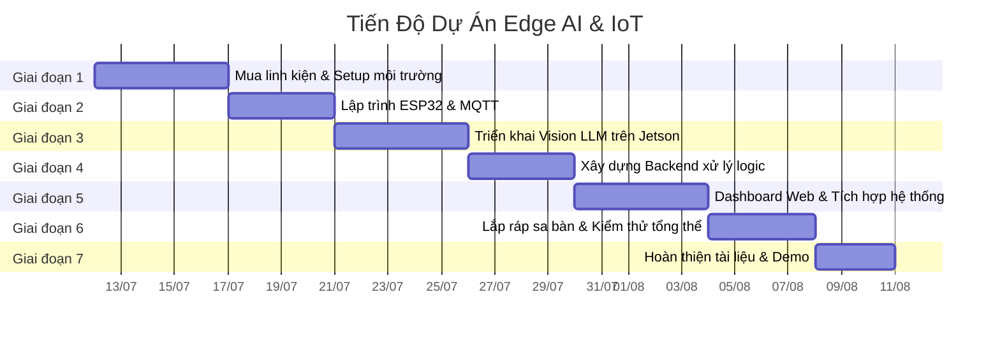

# 📅 Kế Hoạch Thực Hiện — Dự Án Edge AI & IoT Giám Sát Sinh Trưởng Nấm

> **Ngày lập:** 11/07/2026
> **Thời gian dự kiến:** 4–5 tuần
> **Phương pháp:** Chia theo giai đoạn (Phase), mỗi giai đoạn có mục tiêu và sản phẩm cụ thể

---

## Tổng Quan Tiến Độ



---

## Giai Đoạn 1: Chuẩn Bị & Thiết Lập Môi Trường (5 ngày)

**Mục tiêu:** Sẵn sàng toàn bộ phần cứng và phần mềm nền tảng.

### Công việc

- [ ] **1.1** Đặt mua linh kiện theo danh sách BOM (`01_danh_sach_linh_kien.md`)
- [ ] **1.2** Kiểm tra và cập nhật JetPack trên Jetson Orin Nano
- [ ] **1.3** Cài đặt Docker trên Jetson (nếu chưa có)
- [ ] **1.4** Cài đặt **Ollama** trên Jetson và pull model Vision LLM (ví dụ: `llava`, `moondream`)
- [ ] **1.5** Cài đặt **Mosquitto MQTT Broker** trên Jetson
- [ ] **1.6** Cài đặt **Arduino IDE** hoặc **PlatformIO** trên máy tính để nạp code cho ESP32
- [ ] **1.7** Cài đặt Python 3.10+ và các thư viện cần thiết trên Jetson (`paho-mqtt`, `flask`, `requests`, `opencv-python`)
- [ ] **1.8** Kiểm tra Webcam USB hoạt động trên Jetson (`v4l2-ctl --list-devices`)
- [ ] **1.9** Test kết nối Wi-Fi nội bộ giữa ESP32 và Jetson (ping thử)

### Sản phẩm đầu ra

- Jetson sẵn sàng chạy Ollama, MQTT Broker, Python
- ESP32 nạp được code, kết nối Wi-Fi thành công
- Toàn bộ linh kiện đã nhận đủ và kiểm tra hoạt động

---

## Giai Đoạn 2: Lập Trình ESP32 — Node IoT (4 ngày)

**Mục tiêu:** ESP32 đọc được cảm biến và giao tiếp MQTT ổn định.

### Công việc

- [ ] **2.1** Đấu nối phần cứng: ESP32 ↔ DHT11 ↔ Relay ↔ LED & Còi
- [ ] **2.2** Viết firmware ESP32: Đọc nhiệt độ & độ ẩm từ DHT11 mỗi 5 giây
- [ ] **2.3** Viết firmware ESP32: Kết nối Wi-Fi và publish dữ liệu lên MQTT topic `sensor/data`

  ```json
  {
    "temperature": 28.5,
    "humidity": 85.0,
    "timestamp": "2026-07-15T10:30:00"
  }
  ```

- [ ] **2.4** Viết firmware ESP32: Subscribe MQTT topic `actuator/command` để nhận lệnh điều khiển

  ```json
  {
    "pump": true,
    "harvest_alert": false
  }
  ```

- [ ] **2.5** Viết logic điều khiển Relay: Bật LED xanh khi `pump=true`, bật LED đỏ + Còi khi `harvest_alert=true`
- [ ] **2.6** Test toàn bộ: Gửi lệnh MQTT thủ công bằng `mosquitto_pub`, kiểm tra phản hồi phần cứng
- [ ] **2.7** *(Tùy chọn)* Nạp firmware cho ESP32-CAM: Chụp ảnh và gửi qua HTTP/MQTT

### Sản phẩm đầu ra

- ESP32 publish dữ liệu cảm biến liên tục lên MQTT
- ESP32 nhận lệnh và điều khiển Relay/LED/Còi chính xác
- Sơ đồ đấu nối phần cứng (Fritzing hoặc vẽ tay)

---

## Giai Đoạn 3: Triển Khai Vision LLM trên Jetson (5 ngày)

**Mục tiêu:** Jetson chụp ảnh nấm và phân tích kích thước bằng AI.

### Công việc

- [ ] **3.1** Viết script Python: Chụp ảnh từ Webcam USB bằng OpenCV, lưu ảnh tạm
- [ ] **3.2** Viết script Python: Gửi ảnh tới Ollama API (local) kèm prompt yêu cầu phân tích

  ```
  Prompt: "Phân tích ảnh nấm này. Trả về JSON với trường 'size' có giá trị 'small' hoặc 'large'. Chỉ trả JSON, không giải thích."
  ```

- [ ] **3.3** Xử lý response: Parse JSON từ output của LLM

  ```json
  {
    "size": "large"
  }
  ```

- [ ] **3.4** Xử lý edge case: LLM trả về không đúng format → retry hoặc fallback
- [ ] **3.5** Benchmark hiệu năng: Đo thời gian inference trên Jetson Orin Nano
- [ ] **3.6** Tối ưu prompt engineering để kết quả ổn định và nhất quán
- [ ] **3.7** Viết unit test cho module phân tích ảnh

### Sản phẩm đầu ra

- Module `vision_analyzer.py` hoạt động ổn định
- Thời gian inference < 10 giây/ảnh (mục tiêu)
- Kết quả JSON parse được chính xác > 90% trường hợp

---

## Giai Đoạn 4: Xây Dựng Backend Xử Lý Logic (4 ngày)

**Mục tiêu:** Hệ thống tự động ra quyết định dựa trên dữ liệu cảm biến + AI.

### Công việc

- [ ] **4.1** Viết module `mqtt_handler.py`: Subscribe topic `sensor/data`, lưu dữ liệu vào bộ nhớ/SQLite
- [ ] **4.2** Viết module `decision_engine.py`: Logic ra quyết định

  ```
  Quy tắc:
  - Nếu humidity < 70% → pump = true (bật bơm sương)
  - Nếu AI phân tích size = "large" → harvest_alert = true (báo thu hoạch)
  - Nếu temperature > 35°C → pump = true (làm mát)
  ```

- [ ] **4.3** Viết module `actuator_controller.py`: Publish lệnh điều khiển lên MQTT topic `actuator/command`
- [ ] **4.4** Viết `main.py`: Orchestrator kết hợp tất cả module, chạy vòng lặp chính

  ```
  while True:
      1. Đọc dữ liệu cảm biến từ MQTT
      2. Chụp & phân tích ảnh bằng Vision LLM
      3. Chạy Decision Engine
      4. Gửi lệnh điều khiển về ESP32
      5. Cập nhật Dashboard
      6. Sleep 30 giây
  ```

- [ ] **4.5** Xử lý logging: Ghi log mọi quyết định và hành động
- [ ] **4.6** Test tích hợp: Chạy backend + ESP32 thật, kiểm tra toàn bộ luồng

### Sản phẩm đầu ra

- Backend Python hoàn chỉnh, chạy tự động 24/7
- Decision Engine ra quyết định chính xác theo rule
- Log hệ thống đầy đủ

---

## Giai Đoạn 5: Dashboard Web & Tích Hợp Hệ Thống (5 ngày)

**Mục tiêu:** Giao diện web hiển thị trạng thái hệ thống real-time.

### Công việc

- [ ] **5.1** Thiết kế giao diện Dashboard (mockup/wireframe)
- [ ] **5.2** Xây dựng Web Server bằng Flask (Python) trên Jetson
- [ ] **5.3** Trang chính hiển thị:
  - Nhiệt độ & Độ ẩm hiện tại (cập nhật real-time)
  - Trạng thái AI: Kích thước nấm (`small` / `large`)
  - Trạng thái thiết bị: Bơm (ON/OFF), Cảnh báo thu hoạch (ON/OFF)
  - Ảnh chụp mới nhất từ camera
- [ ] **5.4** Biểu đồ lịch sử nhiệt độ & độ ẩm (dùng Chart.js hoặc Plotly)
- [ ] **5.5** Bảng log sự kiện (thời gian, hành động, lý do)
- [ ] **5.6** API endpoints cho Dashboard:
  - `GET /api/status` — Trạng thái hiện tại
  - `GET /api/history` — Lịch sử dữ liệu
  - `GET /api/latest-image` — Ảnh chụp gần nhất
- [ ] **5.7** Kết nối WebSocket (hoặc polling) để cập nhật real-time
- [ ] **5.8** Responsive design cho cả desktop và mobile
- [ ] **5.9** Tích hợp Dashboard vào luồng `main.py`

### Sản phẩm đầu ra

- Dashboard truy cập được tại `http://<jetson-ip>:5000`
- Hiển thị đầy đủ dữ liệu real-time
- Giao diện đẹp, chuyên nghiệp

---

## Giai Đoạn 6: Lắp Ráp Sa Bàn & Kiểm Thử Tổng Thể (4 ngày)

**Mục tiêu:** Hoàn thiện mô hình vật lý và kiểm thử end-to-end.

### Công việc

- [ ] **6.1** Thiết kế layout sa bàn (vị trí Jetson, ESP32, camera, cảm biến, relay, LED)
- [ ] **6.2** Lắp ráp phần cứng lên sa bàn, đi dây gọn gàng
- [ ] **6.3** Cố định Webcam hướng xuống luống nấm mô phỏng
- [ ] **6.4** Kiểm thử kịch bản 1: Môi trường bình thường → hệ thống ở chế độ idle
- [ ] **6.5** Kiểm thử kịch bản 2: Độ ẩm thấp → bật bơm sương (LED xanh sáng)
- [ ] **6.6** Kiểm thử kịch bản 3: Nấm đạt kích thước lớn → cảnh báo thu hoạch (LED đỏ + Còi)
- [ ] **6.7** Kiểm thử kịch bản 4: Nhiệt độ cao → bật bơm sương (LED xanh sáng)
- [ ] **6.8** Stress test: Chạy liên tục 2–4 tiếng, kiểm tra ổn định
- [ ] **6.9** Fix bug và tối ưu nếu cần

### Sản phẩm đầu ra

- Sa bàn hoàn chỉnh, vận hành ổn định
- Tất cả kịch bản test đều PASS
- Hệ thống chạy liên tục không lỗi

---

## Giai Đoạn 7: Hoàn Thiện Tài Liệu & Demo (3 ngày)

**Mục tiêu:** Sẵn sàng trình bày và bảo vệ dự án.

### Công việc

- [ ] **7.1** Viết báo cáo kỹ thuật đầy đủ
- [ ] **7.2** Vẽ sơ đồ kiến trúc hệ thống (dùng draw.io hoặc Mermaid)
- [ ] **7.3** Quay video demo hoạt động của sa bàn
- [ ] **7.4** Chuẩn bị slide thuyết trình (PowerPoint hoặc Google Slides)
- [ ] **7.5** Tập demo trình bày (dry run)
- [ ] **7.6** Push toàn bộ source code lên GitHub (public hoặc private)
- [ ] **7.7** Viết README.md cho repository

### Sản phẩm đầu ra

- Báo cáo kỹ thuật hoàn chỉnh
- Video demo ≥ 3 phút
- Repository GitHub sạch sẽ, có README
- Slide thuyết trình sẵn sàng

---

## Rủi Ro & Phương Án Dự Phòng

| Rủi Ro                                     | Mức Độ   | Phương Án Dự Phòng                                         |
| ------------------------------------------- | ----------- | --------------------------------------------------------------- |
| Vision LLM chạy chậm trên Jetson         | Trung bình | Thử model nhẹ hơn (moondream2), giảm resolution ảnh        |
| LLM trả về JSON không đúng format      | Cao         | Implement retry logic, regex parse, fallback rule-based         |
| ESP32 mất kết nối Wi-Fi                  | Thấp       | Auto-reconnect trong firmware, buffer dữ liệu cục bộ        |
| Cảm biến DHT11 sai số lớn               | Thấp       | Đọc nhiều lần lấy trung bình, hoặc nâng cấp lên DHT22 |
| Thiếu RAM trên Jetson khi chạy LLM + Web | Trung bình | Tối ưu model quantization, giảm concurrent request           |

---

## Milestone Tổng Kết

| Milestone                     | Tuần      | Tiêu Chí Hoàn Thành                        |
| ----------------------------- | ---------- | ---------------------------------------------- |
| 🟢 M1: Hạ tầng sẵn sàng   | Tuần 1    | Jetson + ESP32 + MQTT hoạt động             |
| 🟢 M2: IoT Node hoàn chỉnh  | Tuần 2    | ESP32 gửi/nhận dữ liệu MQTT ổn định     |
| 🟢 M3: AI hoạt động        | Tuần 2–3 | Vision LLM phân tích ảnh nấm chính xác   |
| 🟢 M4: Hệ thống tự động  | Tuần 3    | Backend tự ra quyết định và điều khiển |
| 🟢 M5: Dashboard hoàn thiện | Tuần 4    | Web hiển thị real-time đầy đủ            |
| 🟢 M6: Sa bàn hoàn chỉnh   | Tuần 4–5 | Mô hình vật lý vận hành ổn định       |
| 🏁 M7: Sẵn sàng demo        | Tuần 5    | Tài liệu + Video + Slide đầy đủ          |
