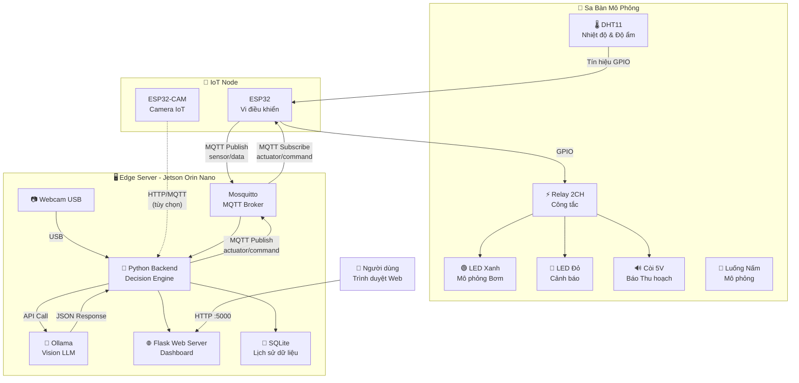
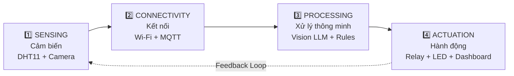
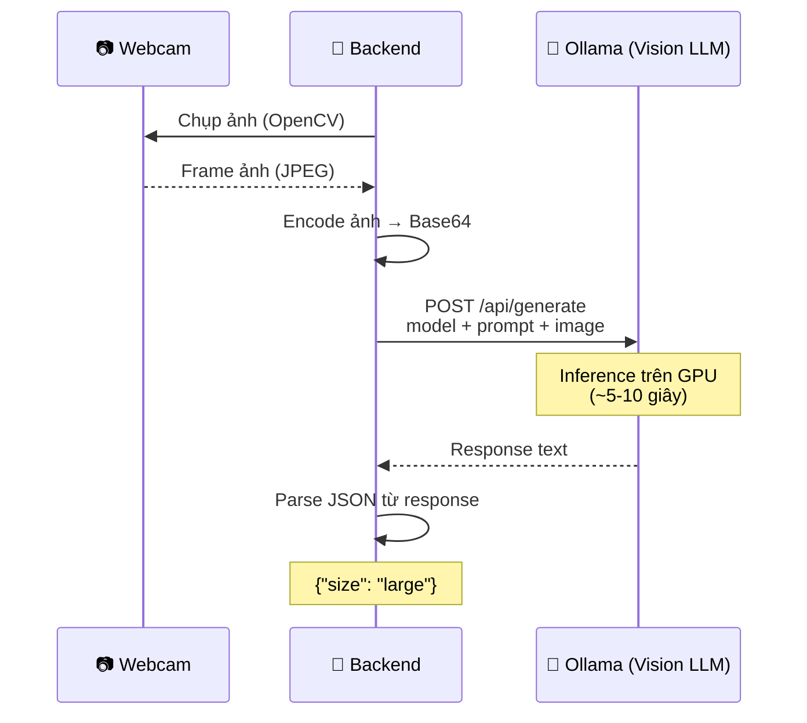
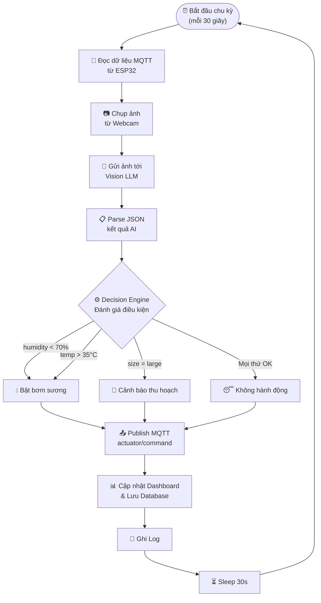
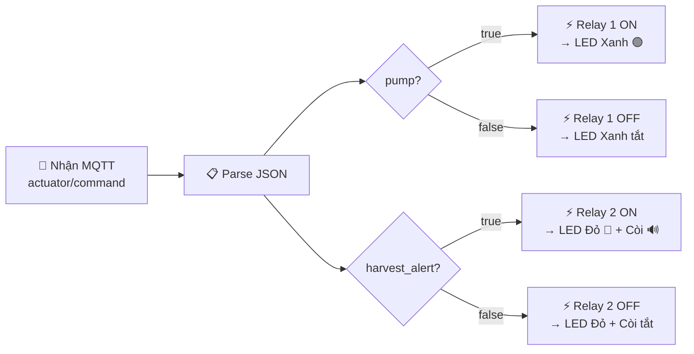

# 📘 Mô Tả Chi Tiết Dự Án — Hệ Thống Edge AI & IoT Giám Sát Sinh Trưởng Nấm

> **Ngày lập:** 11/07/2026  
> **Phiên bản:** 1.0

---

## 1. Giới Thiệu Chung

### 1.1 Tên Dự Án
**Hệ thống Edge AI & IoT Giám sát Sinh trưởng Nấm** — Mô hình sa bàn thu nhỏ cho Nông nghiệp Thông minh (Smart Agriculture).

### 1.2 Mục Tiêu
Xây dựng một hệ thống hoàn chỉnh kết hợp **IoT (Internet of Things)** và **Edge AI (Trí tuệ Nhân tạo tại Biên)** để:

1. **Thu thập** dữ liệu môi trường (nhiệt độ, độ ẩm) và hình ảnh nấm theo thời gian thực.
2. **Phân tích** hình ảnh nấm bằng mô hình Vision LLM chạy trực tiếp trên thiết bị biên (Jetson Orin Nano), không phụ thuộc internet.
3. **Ra quyết định** tự động: Bật bơm sương khi môi trường khô, cảnh báo thu hoạch khi nấm đạt kích thước.
4. **Hiển thị** toàn bộ trạng thái trên Dashboard Web cục bộ.

### 1.3 Phạm Vi
- Đây là mô hình **sa bàn mô phỏng** (demo/prototype), không phải hệ thống sản xuất thực tế.
- Các thiết bị chấp hành (máy bơm, quạt) được thay thế bằng **LED và Còi** để mô phỏng.
- Hệ thống hoạt động hoàn toàn **offline** trên mạng Wi-Fi nội bộ.

### 1.4 Đối Tượng Sử Dụng
- Sinh viên CNTT / Điện tử muốn tìm hiểu IoT + AI
- Giảng viên cần mô hình demo cho môn học liên quan
- Người quan tâm đến ứng dụng AI trong nông nghiệp

---

## 2. Kiến Trúc Hệ Thống

### 2.1 Sơ Đồ Tổng Quan



### 2.2 Mô Hình 4 Lớp IoT

Hệ thống tuân theo mô hình 4 lớp chuẩn của kiến trúc IoT:



| Lớp | Thành Phần | Vai Trò |
|---|---|---|
| **Sensing** | DHT11, Webcam USB, ESP32-CAM | Thu thập dữ liệu thô từ môi trường |
| **Connectivity** | ESP32 (Wi-Fi), MQTT Protocol | Truyền dữ liệu trong mạng nội bộ |
| **Processing** | Jetson Orin Nano, Ollama (Vision LLM), Python Backend | Phân tích dữ liệu, ra quyết định |
| **Actuation** | Relay, LED, Còi, Dashboard Web | Thực thi hành động, hiển thị kết quả |

---

## 3. Chi Tiết Từng Thành Phần

### 3.1 Node IoT — ESP32

**Vai trò:** Thu thập dữ liệu cảm biến và điều khiển thiết bị chấp hành.

**Chức năng chính:**
- Đọc nhiệt độ và độ ẩm từ DHT11 theo chu kỳ (mỗi 5 giây)
- Kết nối Wi-Fi nội bộ, giao tiếp MQTT với Jetson
- Publish dữ liệu cảm biến lên topic `sensor/data`
- Subscribe topic `actuator/command` để nhận lệnh điều khiển
- Điều khiển Relay 2 kênh để bật/tắt LED và Còi

**Giao thức MQTT:**

| Topic | Hướng | Payload (JSON) |
|---|---|---|
| `sensor/data` | ESP32 → Jetson | `{"temperature": 28.5, "humidity": 85.0, "timestamp": "..."}` |
| `actuator/command` | Jetson → ESP32 | `{"pump": true, "harvest_alert": false}` |
| `sensor/status` | ESP32 → Jetson | `{"online": true, "ip": "192.168.1.100"}` |

**Sơ đồ đấu nối GPIO:**

| Chân ESP32 | Kết Nối Tới | Mục Đích |
|---|---|---|
| GPIO 4 | DHT11 DATA | Đọc cảm biến |
| GPIO 26 | Relay IN1 | Điều khiển bơm (LED xanh) |
| GPIO 27 | Relay IN2 | Điều khiển cảnh báo (LED đỏ + Còi) |
| 3.3V | DHT11 VCC | Cấp nguồn cảm biến |
| 5V (VIN) | Relay VCC | Cấp nguồn Relay |
| GND | GND chung | Mass chung |

### 3.2 Edge Server — Jetson Orin Nano

**Vai trò:** Trung tâm xử lý thông minh của toàn hệ thống.

**Thông số kỹ thuật:**
- CPU: ARM Cortex-A78AE (6 nhân)
- GPU: NVIDIA Ampere (1024 CUDA cores)
- RAM: 8GB LPDDR5
- Storage: NVMe SSD (khuyến nghị ≥ 64GB)
- OS: JetPack (Ubuntu-based)

**Các dịch vụ chạy trên Jetson:**

| Dịch Vụ | Port | Mô Tả |
|---|---|---|
| Mosquitto MQTT Broker | 1883 | Nhận/gửi message MQTT |
| Ollama API | 11434 | Serving Vision LLM |
| Flask Web Server | 5000 | Dashboard & REST API |
| Python Backend | — | Decision Engine, chạy nền |

### 3.3 Vision LLM — Phân Tích Hình Ảnh

**Vai trò:** Phân tích ảnh nấm và xác định giai đoạn sinh trưởng.

**Luồng xử lý:**



**Chi tiết API Call tới Ollama:**

```python
# Endpoint: POST http://localhost:11434/api/generate
# Payload:
{
    "model": "llava",  # hoặc "moondream"
    "prompt": "Analyze this mushroom image. Return JSON only with field 'size' having value 'small' or 'large'. No explanation.",
    "images": ["<base64_encoded_image>"],
    "stream": false
}
```

**Output kỳ vọng:**
```json
{
    "size": "small"    // Nấm còn nhỏ, chưa cần thu hoạch
}
// hoặc
{
    "size": "large"    // Nấm đủ lớn, cần thu hoạch
}
```

### 3.4 Decision Engine — Bộ Não Logic

**Vai trò:** Tổng hợp dữ liệu và ra quyết định điều khiển.

**Bảng quy tắc (Rule Table):**

| # | Điều Kiện | Hành Động | Lý Do |
|---|---|---|---|
| R1 | `humidity < 70%` | `pump = ON` | Độ ẩm thấp, cần bơm sương |
| R2 | `humidity >= 70%` AND `temperature <= 35°C` | `pump = OFF` | Môi trường đủ ẩm, nhiệt độ ổn |
| R3 | `temperature > 35°C` | `pump = ON` | Nhiệt quá cao, bơm sương để làm mát |
| R4 | AI: `size = "large"` | `harvest_alert = ON` | Nấm đủ lớn, cảnh báo thu hoạch |
| R5 | AI: `size = "small"` | `harvest_alert = OFF` | Nấm còn nhỏ, tiếp tục nuôi |

**Độ ưu tiên:** R4 > R3 > R1 > R2 > R5 (Cảnh báo thu hoạch ưu tiên cao nhất)

### 3.5 Dashboard Web

**Vai trò:** Giao diện giám sát trực quan cho người dùng.

**Các thành phần hiển thị:**

| Khu Vực | Nội Dung | Cập Nhật |
|---|---|---|
| Header | Tên hệ thống, trạng thái kết nối | — |
| Card Nhiệt độ | Giá trị °C hiện tại, gauge chart | Real-time (5s) |
| Card Độ ẩm | Giá trị %RH hiện tại, gauge chart | Real-time (5s) |
| Card AI Status | Kích thước nấm (small/large), ảnh mới nhất | Mỗi 30s |
| Trạng thái thiết bị | Bơm ON/OFF, Cảnh báo ON/OFF | Real-time |
| Biểu đồ lịch sử | Line chart nhiệt độ & độ ẩm 24h | Mỗi 5 phút |
| Bảng log | Timestamp + Sự kiện + Hành động | Mỗi sự kiện |

**API Endpoints:**

| Method | Endpoint | Mô Tả |
|---|---|---|
| GET | `/api/status` | Trạng thái hiện tại toàn hệ thống |
| GET | `/api/history?hours=24` | Lịch sử dữ liệu cảm biến |
| GET | `/api/latest-image` | Ảnh chụp gần nhất từ camera |
| GET | `/api/events?limit=50` | Danh sách sự kiện gần nhất |
| POST | `/api/manual-control` | Điều khiển thủ công (override) |

---

## 4. Công Nghệ Sử Dụng

### 4.1 Phần Cứng

| Thành Phần | Công Nghệ | Ghi Chú |
|---|---|---|
| Edge Server | NVIDIA Jetson Orin Nano | GPU NVIDIA Ampere |
| Vi điều khiển | Espressif ESP32 | Wi-Fi + BLE tích hợp |
| Camera IoT | ESP32-CAM (OV2640) | 2MP, JPEG |
| Camera chính | Webcam USB | Plug & Play trên Jetson |
| Cảm biến | DHT11 | Nhiệt độ + Độ ẩm |
| Chấp hành | Relay 5V 2CH | Opto-isolated |

### 4.2 Phần Mềm

| Layer | Công Nghệ | Phiên Bản |
|---|---|---|
| OS (Jetson) | JetPack / Ubuntu | 5.x / 20.04+ |
| AI Runtime | Ollama | Latest |
| Vision Model | LLaVA / Moondream | Quantized (Q4) |
| Backend | Python | 3.10+ |
| MQTT Broker | Eclipse Mosquitto | 2.x |
| Web Framework | Flask | 3.x |
| Frontend | HTML + CSS + JavaScript | — |
| Charting | Chart.js | 4.x |
| Database | SQLite | 3.x |
| Firmware IDE | Arduino IDE / PlatformIO | — |
| Firmware Libs | PubSubClient, DHT sensor library | — |

### 4.3 Giao Thức

| Giao Thức | Sử Dụng Tại | Đặc Điểm |
|---|---|---|
| **MQTT** | ESP32 ↔ Jetson | Lightweight, pub/sub, QoS 1 |
| **HTTP REST** | Dashboard ↔ Backend | Request/Response, JSON |
| **USB** | Webcam → Jetson | Plug & Play, bandwidth cao |
| **GPIO** | ESP32 ↔ DHT11/Relay | Digital I/O |

---

## 5. Luồng Dữ Liệu Chi Tiết

### 5.1 Luồng Chính (Main Loop)



### 5.2 Luồng Phản Hồi ESP32



---

## 6. Cấu Trúc Thư Mục Dự Án

```
jetson_project/
├── 📄 01_danh_sach_linh_kien.md         # Danh sách linh kiện (BOM)
├── 📄 02_ke_hoach_du_an.md              # Kế hoạch thực hiện
├── 📄 03_mo_ta_du_an.md                 # Mô tả chi tiết (file này)
├── 📄 04_kich_ban_du_an.md              # Kịch bản demo
│
├── 📁 firmware/                          # Code cho ESP32
│   ├── esp32_iot_node/
│   │   └── esp32_iot_node.ino           # Firmware chính
│   └── esp32_cam/
│       └── esp32_cam.ino                # Firmware ESP32-CAM
│
├── 📁 backend/                           # Code Python trên Jetson
│   ├── main.py                          # Orchestrator chính
│   ├── mqtt_handler.py                  # Xử lý MQTT
│   ├── vision_analyzer.py              # Phân tích ảnh AI
│   ├── decision_engine.py              # Logic ra quyết định
│   ├── actuator_controller.py          # Gửi lệnh điều khiển
│   ├── config.py                        # Cấu hình hệ thống
│   └── requirements.txt                # Dependencies
│
├── 📁 dashboard/                         # Web Dashboard
│   ├── templates/
│   │   └── index.html                   # Trang chính
│   ├── static/
│   │   ├── css/
│   │   │   └── style.css
│   │   └── js/
│   │       └── dashboard.js
│   └── app.py                           # Flask web server
│
├── 📁 database/                          # Lưu trữ dữ liệu
│   └── mushroom_monitor.db             # SQLite database
│
├── 📁 docs/                              # Tài liệu bổ sung
│   ├── wiring_diagram.png              # Sơ đồ đấu nối
│   ├── architecture.png                # Sơ đồ kiến trúc
│   └── demo_script.md                  # Script demo
│
└── 📄 README.md                          # Hướng dẫn tổng quan
```

---

## 7. Yêu Cầu Phi Chức Năng

| Yêu Cầu | Tiêu Chí | Mục Tiêu |
|---|---|---|
| **Độ trễ** | Từ chụp ảnh → ra quyết định | < 15 giây |
| **Tính ổn định** | Chạy liên tục không crash | ≥ 4 tiếng |
| **Offline** | Không phụ thuộc internet | 100% |
| **Accuracy** | AI phân loại đúng kích thước nấm | ≥ 85% |
| **Dashboard** | Cập nhật dữ liệu | Real-time (≤ 5s delay) |
| **Bảo trì** | Code có comment, modular | Dễ mở rộng |

---

## 8. Giới Hạn & Hướng Phát Triển

### 8.1 Giới Hạn Hiện Tại
- Chỉ phân loại 2 mức kích thước nấm (small/large), chưa chi tiết hơn
- Sử dụng DHT11 có độ chính xác thấp (±2°C, ±5%RH)
- Chưa có cơ chế OTA (cập nhật firmware từ xa) cho ESP32
- Dashboard chưa có xác thực người dùng (authentication)

### 8.2 Hướng Phát Triển
- Thêm phân loại chi tiết hơn: `tiny` → `small` → `medium` → `large` → `harvest`
- Nâng cấp lên DHT22 hoặc BME280 cho độ chính xác cao hơn
- Thêm cảm biến CO₂ (MH-Z19) và cảm biến ánh sáng (BH1750)
- Tích hợp YOLO object detection thay vì Vision LLM
- Thêm cơ chế OTA update cho ESP32
- Mobile app (React Native) kết nối qua API
- Mở rộng lên nhiều Node IoT (multi-zone monitoring)
