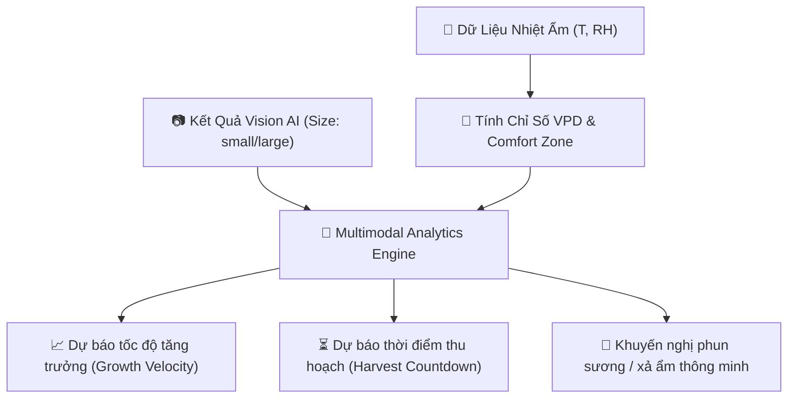

# 📊 Đề Xuất Hệ Thống Phân Tích Dữ Liệu Nhiệt Độ & Độ Ẩm Chuyên Sâu

**Dự án:** Edge AI & IoT Giám Sát Sinh Trưởng Nấm  
**Thời gian cập nhật:** 19/07/2026  
**Thành phần áp dụng:** Edge Server Python Backend (`backend/decision_engine.py`) & Web Dashboard (`WEB_IOT`)

---

## 🎯 1. Đặt Vấn Đề

Trong các hệ thống giám sát môi trường trồng nấm truyền thống, dữ liệu Nhiệt độ ($T$) và Độ ẩm ($RH$) thường chỉ được so sánh đơn thuần với các ngưỡng cố định (ví dụ: $T > 35^\circ C$ hoặc $RH < 70\%$). Hạn chế của phương pháp này là:
- Chưa đánh giá được khả năng thoát hơi nước thực tế của tơ nấm.
- Không phát hiện sớm các nguy cơ bùng phát bệnh nấm mốc do độ ẩm bão hòa kéo dài.
- Chưa dự báo được tốc độ sinh trưởng và thời điểm thu hoạch tối ưu khi kết hợp với mô hình Vision AI.

---

## 📐 2. Các Chỉ Số Phân Tích Chuyên Sâu

### 2.1 Chỉ Số Áp Suất Hơi Nước VPD (Vapor Pressure Deficit)
VPD là chỉ số tiêu chuẩn vàng trong nông nghiệp công nghệ cao, phản ánh chênh lệch giữa áp suất hơi nước bão hòa bên trong tai nấm và áp suất hơi nước thực tế của không khí xung quanh.

#### Công thức tính toán:
1. Áp suất hơi nước bão hòa $VP_{\text{sat}}(T)$ (đơn vị: $\text{kPa}$):
$$VP_{\text{sat}}(T) = 0.61078 \times \exp\left(\frac{17.27 \times T}{T + 237.3}\right)$$

2. Áp suất hơi nước thực tế $VP_{\text{act}}(T, RH)$ (đơn vị: $\text{kPa}$):
$$VP_{\text{act}} = VP_{\text{sat}}(T) \times \left(\frac{RH}{100}\right)$$

3. Chỉ số VPD:
$$VPD = VP_{\text{sat}}(T) - VP_{\text{act}} = VP_{\text{sat}}(T) \times \left(1 - \frac{RH}{100}\right)$$

#### Ngưỡng đánh giá VPD:
- **VPD $< 0.3 \text{ kPa}$ (Bão hòa ẩm / Quá thấp):** Nấm không thể thoát hơi nước $\rightarrow$ Đọng nước trên tai nấm, nguy cơ vi khuẩn thối nhũn và nấm mốc xanh (Trichoderma).
- **VPD $0.3 \text{ - } 0.8 \text{ kPa}$ (Vùng Tối Ưu):** Nấm hô hấp, trao đổi chất và vận chuyển dinh dưỡng đạt hiệu suất cao nhất.
- **VPD $0.8 \text{ - } 1.2 \text{ kPa}$ (Khô Hạn Nhẹ):** Nấm thoát hơi nước nhanh hơn bình thường $\rightarrow$ Cần bổ sung ẩm ngắt quãng.
- **VPD $> 1.2 \text{ kPa}$ (Khô Hạn Cực Độ / Quá cao):** Tơ nấm bị rút nước cưỡng bức $\rightarrow$ Nứt tai nấm, cháy tơ, teo mầm nấm non.

---

### 2.2 Vùng Sinh Trưởng Sinh Học (Growth Comfort Zone Index)

Hệ thống phân loại môi trường thời gian thực dựa trên kết hợp đồng thời $T$ và $RH$:

| Vùng Trạng Thái | Điều Kiện Nhiệt - Ẩm | Đánh Giá Sinh Học | Khuyến Nghị Điều Khiển |
| :--- | :--- | :--- | :--- |
| 🟢 **Vùng Tối Ưu (Optimal)** | $25^\circ C \le T \le 30^\circ C$ $80\% \le RH \le 90\%$ | Nấm tăng trưởng tối đa, tai nấm dày, màu sắc đạt chuẩn. | Duy trì trạng thái tự động. |
| 🟡 **Vùng Khô Hạn (Dehydration)** | $RH < 70\%$ | Tơ nấm bị khô mép, nấm ngưng phát triển. | **Bật Bơm Sương** (Relay 1). |
| 🟠 **Vùng Sốc Nhiệt (Heat Stress)** | $T > 32^\circ C$ | Mất nước nhanh, tơ nấm suy yếu, nấm bị xỉn màu. | Phun sương hạ nhiệt + **Bật quạt gió**. |
| 🔴 **Vùng Bệnh Nấm Mốc (Mold Risk)** | $RH > 92\%$ ($> 4\text{h}$) $T \ge 28^\circ C$ | Nguy cơ bùng phát nấm mốc xanh, vi khuẩn thối gốc. | Tắt bơm sương + **Bật quạt xả ẩm**. |

---

### 2.3 Phân Tích Dao Động Nhiệt - Ẩm Ngày/Đêm (Diurnal Stability)

1. **Biên độ dao động nhiệt độ ngày/đêm ($\Delta T = T_{\max} - T_{\min}$):**
   - Nếu $\Delta T > 8^\circ C/\text{ngày}$: Nấm bị sốc nhiệt ngày/đêm, dễ dẫn đến hiện tượng rụng mầm nấm non hàng loạt.
2. **Thời gian tích lũy bất lợi (Risk Accumulation Hours):**
   - Đếm tổng số giờ $RH < 70\%$ hoặc $T > 32^\circ C$ trong 24 giờ gần nhất để tính toán **Điểm Sức Khỏe Môi Trường (Environment Health Score - EHS: 0 - 100%)**.

---

### 2.4 Kết Hợp Đa Thức Với Vision AI (Multimodal AI Analytics)

Kết hợp dữ liệu Nhiệt - Ẩm chuỗi thời gian với nhãn AI từ Moondream (`small` / `large`):

1. **Dự báo Tốc độ Sinh trưởng (Growth Velocity):**
   - Khi môi trường ở **Vùng Tối Ưu** ($VPD \approx 0.5 \text{ kPa}$), nấm lớn từ `small` $\rightarrow$ `large` trong **24 - 36 giờ**.
   - Khi môi trường ở **Vùng Khô Hạn hoặc Sốc Nhiệt**, thời gian sinh trưởng bị kéo dài thêm **48 - 72 giờ**.
2. **Dự báo Thời điểm Thu hoạch (Harvest Countdown):**
   - Tính toán đếm ngược thời gian thu hoạch lý tưởng: *"Dự kiến tai nấm sẽ đạt kích thước chuẩn thu hoạch trong 16 - 20 giờ tới"*.

---

## 🚀 3. Kế Hoạch Lập Trình Triển Khai

### 3.1 Cập nhật Module Backend (`backend/decision_engine.py`)
- Bổ sung hàm `calculate_vpd(temp, hum)` trả về giá trị $VPD$ (kPa).
- Bổ sung hàm `evaluate_growth_zone(temp, hum, vpd)` trả về trạng thái vùng sinh trưởng và Điểm Sức Khỏe Môi Trường (EHS).
- Bổ sung logic điều khiển bơm sương thông minh dựa trên $VPD$ và ngưỡng nhiệt ẩm.

### 3.2 Cập nhật Web Dashboard UI (`WEB_IOT`)
- Hiển thị Widget **Chỉ số VPD (kPa)** và nhãn **Vùng Sinh Trưởng** (Tối Ưu / Khô Hạn / Cảnh Báo Mốc).
- Bổ sung thanh điểm **Environment Health Score (EHS %)**.
