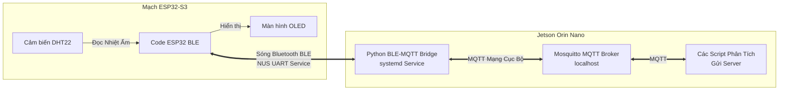

# 📊 Báo Cáo Cấu HÌnh Kết Nối Bluetooth (BLE) ESP32-S3 & Jetson Orin Nano

Hệ thống đã được chuyển đổi thành công từ kết nối Wi-Fi (phụ thuộc vào router ngoài) sang **kết nối không dây Bluetooth Low Energy (BLE) trực tiếp**. Dưới đây là báo cáo kỹ thuật chi tiết về cấu hình, kiến trúc và cách quản lý.

---

## 🏗️ 1. Kiến Trúc Cầu Nối BLE-MQTT (BLE-MQTT Bridge)

Để đảm bảo **không phải thay đổi bất kỳ mã nguồn phân tích/gửi server nào khác** đang chạy trên Jetson, một kiến trúc "Cầu nối" (Bridge) đã được thiết lập:



*   **ESP32-S3** gửi dữ liệu nhiệt ẩm qua sóng BLE định dạng JSON.
*   **Trình cầu nối Python** chạy ngầm trên Jetson nhận dữ liệu từ BLE rồi đẩy vào MQTT Topic `sensor/data` trên localhost.
*   Khi có lệnh điều khiển thiết bị (bơm, còi) từ Topic `actuator/command`, trình cầu nối tự động nhận và chuyển tiếp qua BLE tới ESP32 để đóng ngắt Relay.

---

## 💻 2. Chi Tiết Cấu Hình Phần Cứng & Phần Mềm

### A. Phía ESP32-S3
*   **Chân phần cứng (Pins):**
    *   `OLED_SDA` -> **G1**, `OLED_SCL` -> **G2** (Hoàn toàn không xung đột với USB JTAG CDC).
    *   `RELAY_PUMP` -> **G5**, `RELAY_ALERT` -> **G6** (Tránh chân SPI Flash hệ thống).
    *   `DHTPIN` -> **G4**.
*   **Cấu hình BLE:**
    *   Tên thiết bị phát sóng: `ESP32_MushroomNode`
    *   Địa chỉ MAC phần cứng: `1C:DB:D4:76:69:2D`
    *   **NUS Service UUID:** `6E400001-B5A3-F393-E0A9-E50E24DCCA9E`
    *   **TX UUID (Gửi dữ liệu):** `6E400003-B5A3-F393-E0A9-E50E24DCCA9E` (Notify)
    *   **RX UUID (Nhận lệnh):** `6E400002-B5A3-F393-E0A9-E50E24DCCA9E` (Write)
*   **File mã nguồn:** [esp32_iot_node.ino](file:///home/GiaHung/Projects/IoT_project/esp32_iot_node/esp32_iot_node.ino)

### B. Phía Jetson Orin Nano
*   **Tệp cầu nối:** Lưu tại `/home/jetson/ble_mqtt_bridge.py` trên Jetson.
*   **Thư viện sử dụng:** `bleak` (xử lý Bluetooth async) và `paho-mqtt` (xử lý MQTT cục bộ).
*   **Hệ thống dịch vụ ngầm (systemd Service):**
    Đã đăng ký thành công dịch vụ chạy ngầm tự khởi động cùng hệ thống tại `/etc/systemd/system/ble_mqtt_bridge.service`.

---

## 🔍 3. Hướng Dẫn Vận Hành & Quản Lý Trên Jetson

Dịch vụ đã được cấu hình tự khởi động cùng Jetson và tự động kết nối lại (Auto-reconnect) nếu ESP32 bị mất nguồn rồi bật lại. 

Để theo dõi hoặc quản lý dịch vụ trên Jetson, bạn có thể sử dụng các lệnh sau:

### 1. Kiểm tra trạng thái hoạt động:
```bash
systemctl status ble_mqtt_bridge.service
```

### 2. Xem nhật ký truyền nhận dữ liệu (Realtime logs):
```bash
journalctl -u ble_mqtt_bridge.service -f -n 50
```
*(Bạn sẽ thấy dữ liệu nhiệt độ/độ ẩm thực tế từ BLE chuyển đổi sang MQTT in ra màn hình liên tục mỗi 5 giây).*

### 3. Khởi động lại dịch vụ:
```bash
sudo systemctl restart ble_mqtt_bridge.service
```

### 4. Dừng dịch vụ:
```bash
sudo systemctl stop ble_mqtt_bridge.service
```

---

## 🎯 4. Kết Quả Xác Minh Thực Tế
*   **ESP32:** Hiển thị trạng thái **`BLE: CONNECTED`** lên màn hình OLED.
*   **Dữ liệu truyền nhận thực tế:**
    *   Nhận từ BLE: `{"temperature":35.4,"humidity":73.2,"esp32_online":true}`
    *   Đẩy vào MQTT Topic `sensor/data` thành công.
    *   Gửi lệnh bật/tắt bơm từ MQTT `actuator/command` trung chuyển qua BLE thành công.
