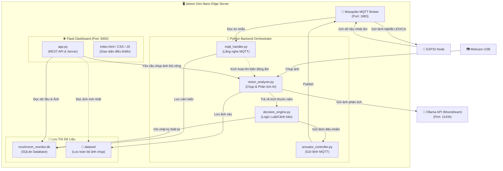
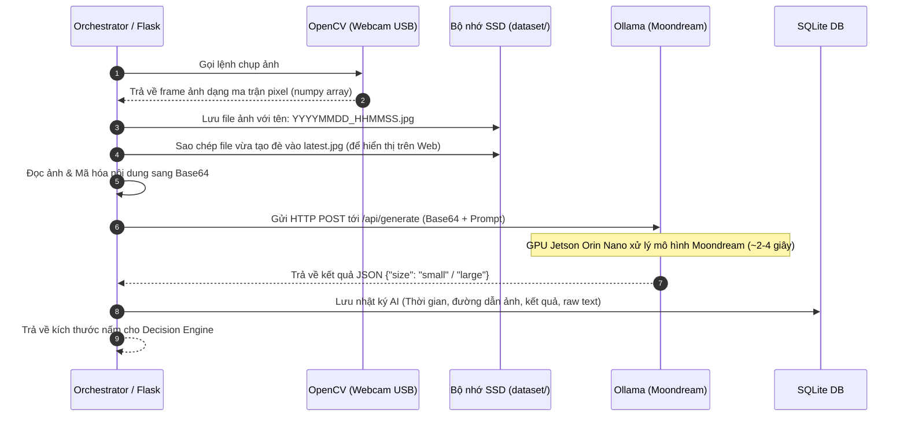
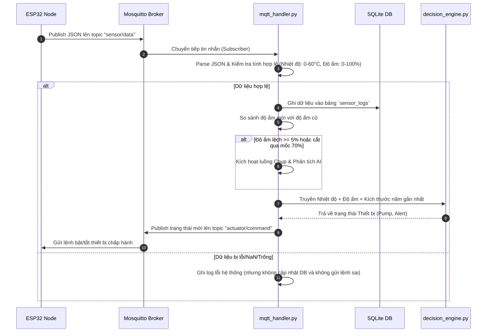

# 🖥️ Tài Liệu Cấu Trúc Phần Mềm Edge Server (Jetson Orin Nano)

Tài liệu này đặc tả chi tiết thiết kế phần mềm chạy trên Edge Server (Jetson Orin Nano), tập trung vào hai luồng dữ liệu chính: **Luồng Camera (Camera Stream)** và **Luồng Dữ Liệu cảm biến/điều khiển (Data Stream)**.

---

## 🗺️ 1. Tổng Quan Kiến Trúc Thành Phần trên Jetson



---

## 📷 2. Luồng Xử Lý Camera (Camera Stream & AI Pipeline)

Camera Webcam USB kết nối trực tiếp với Jetson Orin Nano. Thay vì chạy phân tích AI liên tục làm nóng và tốn tài nguyên GPU, luồng camera được cấu hình để hoạt động **theo yêu cầu (On-Demand)**.

### 2.1 Các Kịch Bản Kích Hoạt Chụp & Phân Tích Ảnh (AI Trigger Rules)
AI chỉ kích hoạt chạy trong hai trường hợp:
1. **Người dùng kích hoạt thủ công**: Bấm nút "Chụp & Phân tích ảnh" trên Web Dashboard.
2. **Hệ thống tự động kích hoạt khi có biến động độ ẩm**: 
   - Độ ẩm thay đổi lớn hơn **±5%** so với lần đo gần nhất.
   - Hoặc độ ẩm vượt qua/rớt xuống dưới ngưỡng **70%** (mốc ranh giới bật/tắt bơm sương).

### 2.2 Quy Trình Xử Lý Chi Tiết của Vision Analyzer



### 2.3 Cấu Hình Prompt & Tham Số Gọi Ollama API
* **Endpoint**: `POST http://localhost:11434/api/generate`
* **Payload**:
```json
{
  "model": "moondream",
  "prompt": "Analyze this mushroom image. Return JSON only with field 'size' having value 'small' or 'large'. Do not explain or include any markdown formatting.",
  "images": ["/9j/4AAQSkZJRgABAQAAAQABAAD/2wBDAAMCAgMCAgMDAwME... [Base64 Encoded Image]"],
  "stream": false
}
```
* **Regex Fallback (Phòng ngừa)**: Nếu mô hình không trả về đúng định dạng JSON thuần mà kèm theo giải thích, backend sử dụng Regex để trích xuất giá trị trường `size` (`small` hoặc `large`). Nếu thất bại, giá trị mặc định là `small` để tránh báo động giả.

---

## 📊 3. Luồng Dữ Liệu Hệ Thống (Data Stream & Decision Pipeline)

Luồng dữ liệu thu thập từ ESP32 qua giao thức MQTT, được lọc nhiễu, lưu vào cơ sở dữ liệu SQLite và truyền tải tới Decision Engine để gửi lệnh phản hồi về ESP32.

### 3.1 Quy Trình Xử Lý Dữ Liệu Cảm Biến



---

## 🗄️ 4. Thiết Kế Cơ Sở Dữ Liệu SQLite (`mushroom_monitor.db`)

Dữ liệu được lưu trữ trong một tệp SQLite cục bộ trên Jetson để phục vụ hiển thị lịch sử trên Dashboard và lưu trữ tập dữ liệu hình ảnh.

### 4.1 Bảng Dữ Liệu Cảm Biến (`sensor_logs`)
Lưu trữ lịch sử các chỉ số môi trường do ESP32 gửi về.
```sql
CREATE TABLE sensor_logs (
    id INTEGER PRIMARY KEY AUTOINCREMENT,
    temperature REAL NOT NULL,
    humidity REAL NOT NULL,
    timestamp DATETIME DEFAULT CURRENT_TIMESTAMP
);
```

### 4.2 Bảng Nhật Ký AI (`ai_logs`)
Lưu trữ thông tin mỗi lần chạy mô hình phân tích ảnh nấm.
```sql
CREATE TABLE ai_logs (
    id INTEGER PRIMARY KEY AUTOINCREMENT,
    image_path TEXT NOT NULL,         -- Đường dẫn file ảnh theo timestamp
    inferred_size TEXT NOT NULL,      -- "small" hoặc "large"
    raw_response TEXT,                -- Phản hồi thô từ Ollama (phục vụ debug)
    timestamp DATETIME DEFAULT CURRENT_TIMESTAMP
);
```

### 4.3 Bảng Nhật Ký Thiết Bị Chấp Hành (`device_logs`)
Lưu lịch sử trạng thái hoạt động của bơm sương và còi báo để vẽ biểu đồ sự kiện.
```sql
CREATE TABLE device_logs (
    id INTEGER PRIMARY KEY AUTOINCREMENT,
    device_name TEXT NOT NULL,        -- "pump" hoặc "harvest_alert"
    state INTEGER NOT NULL,           -- 0 (Tắt) hoặc 1 (Bật)
    trigger_reason TEXT NOT NULL,     -- Lý do: "Độ ẩm thấp (<70%)", "AI phát hiện nấm lớn", "Nút bấm Web",...
    timestamp DATETIME DEFAULT CURRENT_TIMESTAMP
);
```

---

## 📁 5. Cấu Trúc Thư Mục Triển Khai trên Jetson

Thư mục dự án trên Jetson (`~/jetson_project`) được cấu trúc mạch lạc như sau:

```text
~/jetson_project/
├── backend/
│   ├── config.py                 # File chứa tất cả cấu hình cổng, IP, Model, SQLite
│   ├── database.py               # Module quản lý kết nối, tạo bảng & ghi SQLite
│   ├── mqtt_handler.py           # Quản lý luồng MQTT (Sub/Pub) & logic sự kiện ẩm
│   ├── vision_analyzer.py        # Logic chụp webcam (OpenCV) & gọi API Ollama
│   ├── decision_engine.py        # Định nghĩa luật ra quyết định (Rule Engine)
│   ├── main.py                   # Tập lệnh điều phối vòng lặp chính của Edge Server
│   └── requirements.txt          # Các thư viện Python cần cài (opencv-python, paho-mqtt, Flask, requests)
│
├── dashboard/
│   ├── app.py                    # Flask Web Server, cung cấp REST API cho giao diện
│   ├── templates/
│   │   └── index.html            # Trang giao diện Dashboard chính
│   └── static/
│       ├── css/
│       │   └── style.css         # Thiết kế giao diện (Dark Mode, layout Responsive)
│       ├── js/
│       │   └── dashboard.js      # Thực hiện polling lấy API, vẽ biểu đồ Chart.js, xử lý click chụp ảnh
│       └── images/
│           └── latest.jpg        # Ảnh chụp nấm mới nhất (được ghi đè liên tục)
│
├── dataset/                      # Thư mục lưu toàn bộ lịch sử ảnh nấm chụp được
│   ├── 20260713_120005.jpg
│   ├── 20260713_120530.jpg
│   └── ...
│
└── database/
    └── mushroom_monitor.db       # Cơ sở dữ liệu SQLite cục bộ
```
